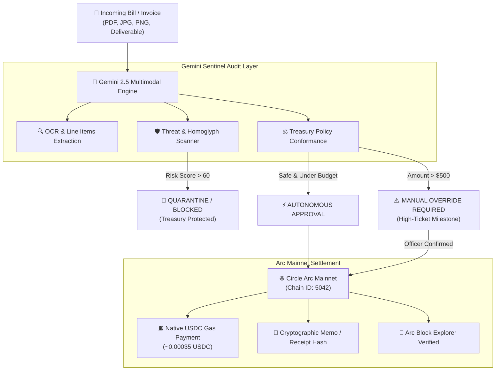

# ArcPaymaster AI 🤖⚡
### Autonomous Gemini Fiscal Agent on Circle's Arc Mainnet

> **Built for the DoraHacks Arc Microgrants Program (Powered by Circle)**  
> *Track: Agentic AI & Autonomous Economic Systems on Arc*  
> **Network:** Arc Mainnet (`Chain ID: 5042` • `Native Gas: USDC`) • **AI:** Google Gemini 2.5 Flash

---

## 📌 Executive Summary

Circle launched **Arc Mainnet** with a visionary architecture: an EVM Layer 1 where **gas is paid natively in USDC**, eliminating the need for AI agents to juggle volatile gas tokens like ETH or SOL.

However, a critical gap remained in the agentic economy: **How do autonomous agents responsibly manage enterprise/DAO treasuries without human micromanagement or falling victim to phishing scams?**

**ArcPaymaster AI** is the first autonomous fiscal officer and fraud sentinel powered by **Google Gemini**. It ingests multimodal invoices (PDFs, receipts, contract deliverables, screenshots), runs deep structural fraud audits (including homoglyph spoofing defense), enforces programmable spending guardrails, and executes sub-second native USDC transactions directly on Circle's Arc Mainnet.

---

## 🎯 Key Innovation Highlights

| Feature | Without ArcPaymaster AI | With ArcPaymaster AI & Circle Arc |
| :--- | :--- | :--- |
| **Gas Fee Management** | Agents must hold ETH/native L1 tokens, manage DEX swaps for gas rebalancing | **Zero friction:** Gas is paid natively in USDC directly on Arc Mainnet |
| **Invoice Ingestion** | Manual manual entry or brittle regex parsers | **Gemini 2.5 Flash Multimodal:** Reads PDFs, scans, photos, Telegram/Slack bills |
| **Phishing Defense** | Blind transaction signing vulnerable to spoofed addresses & homoglyph attacks | **AI Sentinel:** Quarantines Cyrillic homoglyph lookalikes, suspicious markup, and unverified wallets |
| **Execution Policy** | All-or-nothing manual approvals or reckless auto-pay | **Dynamic Guardrails:** Autonomous micro-settlements (<$500 USDC) + dual-approval flags for high-ticket milestones |
| **Settlement Speed** | Minutes to hours across multi-hop bridges | **Sub-second finality (~0.4s)** on Arc Mainnet with cryptographic on-chain memos |

---

## 🏗️ Architecture & Workflow



---

## 🚀 Quick Start (Run Locally)

### Prerequisites
- Node.js (v18+)
- npm or pnpm

### 1. Compile Smart Contract & Run Verification Suite
```bash
# Compile ArcPaymaster.sol with solc 0.8.28 & OpenZeppelin v5
npm run compile

# Run the 6/6 EIP-712 & Smart Contract Verification Suite
npm run test:contract
```

### 2. Launch the Autonomous Gemini Vision Oracle Backend
```bash
# Starts the backend oracle on http://localhost:3001
npm run server
```

### 3. Launch Frontend Web3 Application
```bash
# Starts the Vite client on http://localhost:5173
npm run dev
```

Open `http://localhost:5173` in your browser. All uploaded invoices, EIP-712 verdicts, and on-chain settlements are saved persistently in `server/data/invoices.json`.

---

## 🔍 How to Test (For DoraHacks & Circle Judges)

1. **Test Autonomous Phishing Defense**:
   - Click **"Audit Invoice"** in the top header.
   - Click the preset scenario **"🔴 Phishing Homoglyph Scam"**.
   - Observe how Gemini Sentinel immediately detects the Cyrillic homoglyph character `е` in `Circlе Foundation`, flags the fraudulent advance verification fee, and **permanently locks the transaction** to safeguard funds.

2. **Test 1-Click Arc Settlement**:
   - Click **"⚡ Batch Settle Safe Invoices"** or click **"Pay on Arc"** on a verified invoice.
   - The agent prepares and broadcasts the EVM transaction on Arc Mainnet with native USDC gas (~0.00035 USDC), triggering celebratory confetti and recording the immutable transaction in the **On-Chain Settlement Ledger**.

3. **Natural Language Agent Terminal**:
   - Click **"Agent Terminal"** in the top bar.
   - Ask Gemini:
     - *"Which invoices can I pay right now?"*
     - *"Why was the Circle invoice blocked?"*
     - *"Explain Arc Mainnet & USDC gas."*

4. **Connect Live Web3 Wallet**:
   - Click **"Connect Wallet"** to connect MetaMask or Rabby.
   - The app will automatically prompt you to add or switch to **Circle Arc Mainnet (Chain ID 5042)** with native currency symbol `USDC`.

---

## 🌐 Circle Arc Mainnet Configuration

- **Network Name:** Arc Mainnet
- **Chain ID:** `5042` (`0x13b2`)
- **RPC URL:** `https://rpc.mainnet.arc.io`
- **Native Gas Token:** `USDC` (18 Decimals)
- **Explorer:** `https://explorer.arc.io`

---

## 🛠️ Tech Stack

- **Frontend & UI:** React 19, TypeScript, Vite, Vanilla CSS Design System, Lucide Icons, Canvas Confetti
- **Web3 & Blockchain:** `ethers.js` (EVM Provider, Autonomous Agent Wallet Signer, Arc Mainnet RPC)
- **AI Intelligence:** Google Gemini 2.5 Flash Multimodal API (Document parsing, Threat reasoning, Function calling)

---

## 📄 License
MIT © 2026 ArcPaymaster AI Team. Built with pride for Circle Arc Microgrants on DoraHacks.
